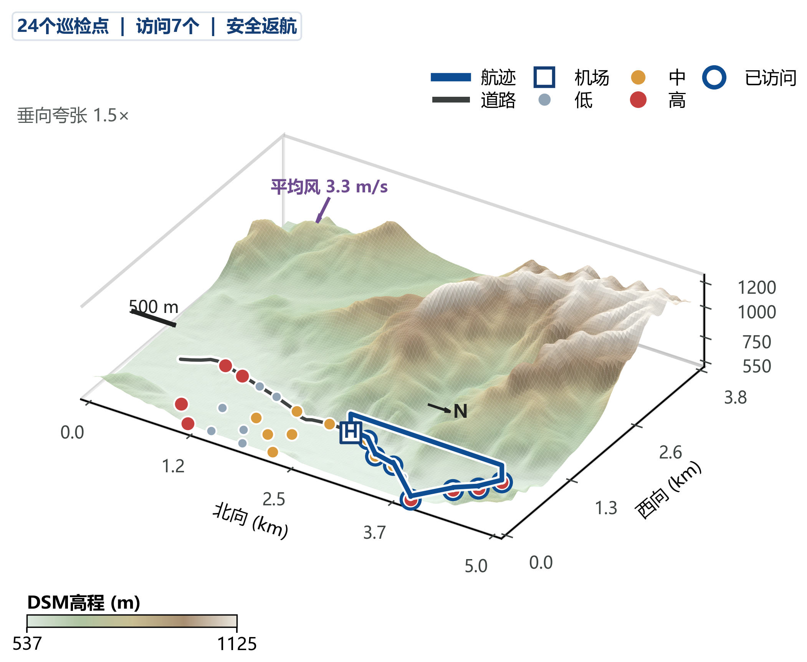

# 山区公路无人机固定巡检点路径规划

本项目面向山区公路固定巡检点的无人机路径规划研究。无人机从机场出发，在电量、航程、任务时间、风场、地形、动力学和强制返航等约束下，选择并访问具有不同优先级的巡检点，最终安全返回机场。研究目标是在保障安全返航的前提下，提高优先级加权覆盖率，并兼顾资源消耗、任务效率、规划速度和扰动鲁棒性。

当前工作区对应第二次正式实验，训练、正式评价、统计分析和论文制图均已完成。所有结果均来自仿真环境；真实DSM实验用于跨地理区域的零样本仿真迁移验证，不构成真实飞行测试或安全认证。



> 图中展示真实太行山DSM任务中的公路、机场、固定巡检点、优先级、风场与PPO+Pointer安全返航航迹。该图用于空间关系解释，不承担统计显著性证明。

## 研究方法

### 正式学习模型

论文最终评价集合包含7种模型，每种模型使用5个独立训练种子：

| 模型ID | 论文名称 | 作用 |
|---|---|---|
| `full` | PPO + Pointer | 完整模型 |
| `traditional_ppo` | Traditional PPO | 纯MLP学习基线 |
| `a2c_pointer` | A2C + Pointer | Pointer学习基线 |
| `no_priority_bias` | w/o Priority Bias | 优先级注意力偏置消融 |
| `no_domain_randomization` | w/o Domain Randomization | 域随机化消融 |
| `no_resource_shaping` | w/o Resource Shaping | 资源辅助奖励消融 |
| `no_return_reserve` | w/o Return Reserve | 返航预留掩码消融 |

传统PPO采用固定24节点槽、独立返航槽和合法动作掩码，不使用Pointer、Attention或节点编码器。旧`ppo_mlp`模型不属于正式论文评价集合，仅作为历史排除项记录。

### 传统规划基线

正式评价还包含最近可行点、优先级资源贪心、ACO、GA、SA、PSO、A*、MILP和exact Pareto DP等传统方法。不同算法按照冻结矩阵分配至主基线、补充基线或代表性真实地形基线，不能将未运行的算法—任务组合视为缺失结果后自行补齐。

## 实验规模与完成状态

| 项目 | 正式数量 |
|---|---:|
| 学习模型 | 7种 |
| 正式checkpoint | 35个 |
| 论文有效训练 | 105,000回合 |
| 未见合成地图任务 | 216个 |
| 真实DSM任务 | 144个 |
| 正式评价记录 | 21,648条 |
| 正式路线记录 | 21,648条 |
| 正式独立图面板 | 72个 |

关键冻结身份：

- 评价矩阵SHA-256：`48a31ee9b58d41a617fff61acb6eba6a2d9a930767d7af15856f70a964686224`
- 正式结果SHA-256：`4b620c21566c2e33c875f6bea2017b741b02a7d30d70aa50add60a6d06214a2c`
- 训练种子：42、43、44、45、46
- 节点规模：16、20、24

16/20/24三种规模均参加训练和测试，因此相关结果只能表述为“训练范围内的多规模表现”，不能称为对未训练节点规模的泛化。

## 评价指标与统计口径

冻结确认性主指标为：

- `safe_weighted_coverage`：路线仅在安全返航且不存在硬约束违规时保留优先级加权覆盖率，否则记为0。

论文分析同时覆盖：

- 优先级加权覆盖率、普通覆盖率和高/中/低优先级覆盖；
- 安全率、返航率、违规率、最低SOC和失败原因；
- 鲁棒性下降量、已知域偏移和隐藏模型/感知误差；
- 安全路线的能耗、航程、总任务时间和预算利用率；
- 在线规划时间、推理时间和传统求解器状态；
- 训练稳定性、跨种子一致性、样本效率和收敛曲线；
- 多目标综合评价、归一化区间与权重敏感性分析。

综合评价属于正式结果完成后的论文叙事扩展，不能替代冻结确认性指标、原始维度、地图层级统计和敏感性证据。统计分析以地图为主要独立单位，任务、训练种子和规划种子均嵌套在地图内。

## 项目结构

```text
.
├─ paper_cli.py                 # 统一审计、统计和制图入口
├─ uav_inspection
│  ├─ core                     # 模型、训练场景、协议和基础评价
│  ├─ experiments              # 正式实验与checkpoint接口
│  ├─ generation               # 地图、任务与证书构建
│  ├─ evaluation               # v3.2.14正式评价工作器
│  ├─ analysis                 # 统计、综合评价与敏感性分析
│  └─ figures                  # 正式论文制图
├─ python_classical_algs       # 传统规划基线
├─ scripts/protocol_builders   # 冻结协议生成器
├─ tools/maintenance           # 清理、迁移和完整性审计
├─ tests                       # 单元测试与合同测试
├─ map_data                    # 合成地图、DSM和道路资产
├─ scenario_data               # 兼容场景输入
└─ paper_runs                  # 模型、协议、结果、统计与正式图片
```

详细索引：

- [论文工作区索引](PAPER_WORKSPACE_INDEX.md)
- [最终交接说明](HANDOFF.md)
- [Python源码迁移说明](docs/PYTHON_SOURCE_LAYOUT.md)
- [完整正式图片包](paper_runs/multimap_v3_2_14/figures/paper_final)
- [逐面板Source Data](paper_runs/multimap_v3_2_14/figures/paper_final/source_data)
- [冻结协议链](paper_runs/protocols)

## 环境与依赖

正式冻结环境记录于[`frozen_test_v1/protocol.json`](paper_runs/protocols/frozen_test_v1/protocol.json)：

| 项目 | 正式环境 |
|---|---|
| 操作系统 | Windows 10，AMD64 |
| Python | CPython 3.9.25 |
| PyTorch | 2.4.1+cu124 |
| NumPy | 1.26.4 |
| SciPy | 1.13.1 |
| GPU | NVIDIA GeForce RTX 4070 Laptop GPU |
| GPU驱动 | 572.83 |

活动代码还使用Pandas、Matplotlib、Pillow、Rasterio、Affine、PyProj、Shapely、Requests和Pytest等依赖。项目当前未提供`requirements.txt`或通用一键安装脚本；正式复现应优先使用冻结环境或根据实际导入建立隔离环境，不应凭README猜测依赖版本。

## 快速检查

在项目根目录运行：

```powershell
python -X utf8 -B paper_cli.py show-paths
python -X utf8 -B paper_cli.py audit-workspace
python -X utf8 -B paper_cli.py audit-checkpoints
```

- `show-paths`：显示协议、正式结果、分析、图片和源码快照位置。
- `audit-workspace`：核对模型、任务、结果、路线、图片和关键哈希。
- `audit-checkpoints`：核对7种模型、35个checkpoint及其登记身份。

## 测试、统计与制图复现

### 完整测试

```powershell
$env:PYTHONDONTWRITEBYTECODE='1'
$env:CUDA_VISIBLE_DEVICES=''
& 'D:\anaconda3\envs\Deeplearning-gpu\python.exe' -X utf8 -B `
  -m pytest -q tests
```

当前整理后的验证结果为`189 passed, 2 skipped`。

### 重新计算冻结统计

```powershell
python -X utf8 -B paper_cli.py statistics
```

该命令会重新计算并写入正式分析目录。执行前应确认输入仍为冻结的21,648条正式结果，且不需要保留当前分析文件的逐字节版本。

### 重新生成正式图片

```powershell
python -X utf8 -B paper_cli.py figures
```

该命令会根据冻结统计表和路线重新生成论文图片。执行前应确认目标目录、字体和图形依赖可用；正式图片、图注、source data和manifest位于[`paper_final`](paper_runs/multimap_v3_2_14/figures/paper_final)。

低层入口示例：

```powershell
python -X utf8 -B -m uav_inspection.experiments.v3_2 audit-checkpoints
python -X utf8 -B -m uav_inspection.analysis.v3_2_14_statistics
python -X utf8 -B -m uav_inspection.figures.v3_2_14_split_publication_figures
```

## 数据完整性与来源追溯

源码分层整理前的64个Python文件和3个PowerShell脚本原样保存在[`pre_python_reorganization`](paper_runs/code_snapshots/pre_python_reorganization)。其中：

- `source_snapshot_manifest.json`记录整理前文件大小和SHA-256；
- `source_relocation_map.csv`记录旧路径、活动路径、快照路径和状态；
- `python_reorganization_manifest.json`记录整理前后的文件数量和正式资产身份；
- `post_cleanup_audit.json`记录最终工作区审计结果。

相关审计文件位于[`cleanup_audit_20260802`](paper_runs/cleanup_audit_20260802)。

现存9项冻结源码引用中，有6项能够由整理前快照逐字节复核；以下3项在本次源码整理开始前已经更新，较早冻结版本的源码字节未留存在当前工作区：

- `final_python_ppo_pointer.py`
- `v3_2_14_statistics.py`
- `v3_2_14_split_publication_figures.py`

冻结manifest及其中的历史哈希没有被改写。该留存缺口不改变正式checkpoint、评价矩阵、结果、路线、统计输入或图片文件的冻结身份。

## 使用边界

论文撰写和复算不得混入：

- 第一轮实验的训练、评价或旧publication结果；
- 旧`ppo_mlp`模型及其结果；
- v3.2.1—v3.2.13失败或中间输出；
- pilot、smoke、debug、monitoring和失败fallback结果；
- 已删除的`latest.pt`和`best_candidate.pt`；
- 第一轮实验的旧评价数量口径、旧测试域或旧综合评分规则。

不得根据正式成绩重新挑选地图、任务、扰动、模型、权重范围或代表路线。真实DSM结论应表述为零样本仿真迁移，不应外推为真实飞行性能或安全保证。
